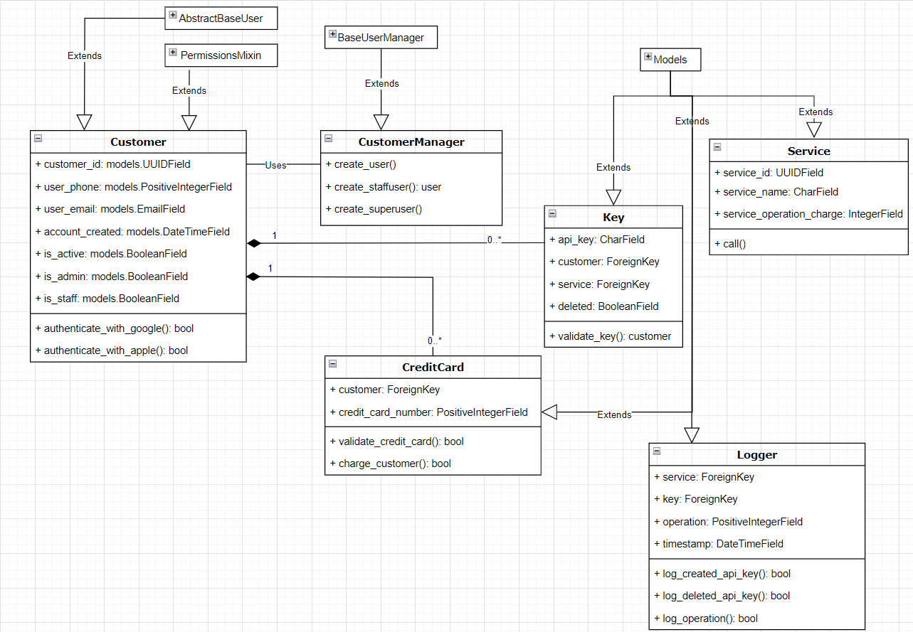

# The API Project
Django code that runs my API server.

# Diagrams

  
Use Case Diagram

  

  

  
Activity Diagram

  

  
Sequence Diagram

  

  
Data Flow Diagram

  

  
Entity relation (ER) Diagram

  

  
Class Diagram

  

